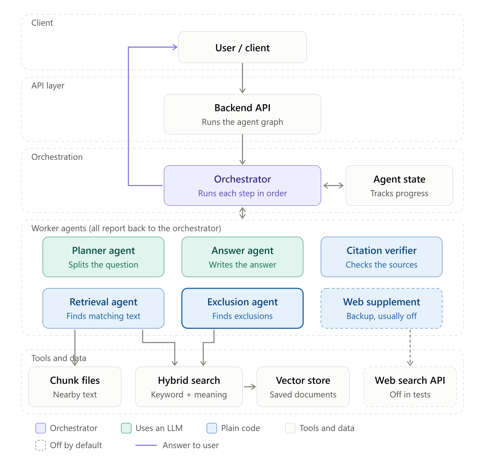
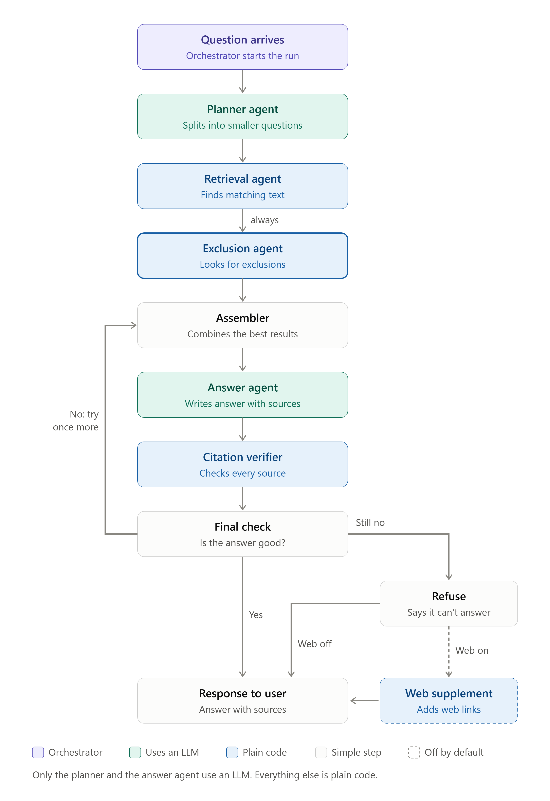

# Agent architecture — Phase 7

The build design for the LangGraph agent and the web fallback tier. Decisions and their
reasoning live in `docs/plan.md`; iteration 1's build record is `docs/RAG_pipleline.md`.
**Nothing here is built yet.** The design is organised by agent, in the order a question moves
through them.

---

## Why, in numbers

Multi-hop recall is **0.143** (3 of 22). The ceiling at top-20 is **0.381**, and **13 of 22
multi-hop questions have gold clauses outside the top 20 entirely** — one query cannot surface
them at any depth, however it is ranked. Chunk size did not move this (Phase 3), a lexical
channel did not (Phase 4), two cross-encoders did not (Phase 5, rejected). The one variable
never changed is the *shape*: one question, one embedding, one pool.

The agent changes what gets asked. It is the only remaining mechanism that can pass 0.381.

Exclusion recall is 0.500 at k=5 and **0.731 at k=20** — so 0.731 is what the mandatory
exclusion pass has to beat, not 0.500.

---

## The architecture

<p align="center">
  
</p>

Who talks to whom. Purple is the orchestrator, green agents call a model, blue agents are plain
code, dashed is off by default. The client and API layers are Phase 8.

<p align="center">
  
</p>

One question, top to bottom. The only branches are the retry and the web tier.

### Why a fixed graph and not a ReAct agent

A tool-calling agent chooses its next action. The spec's central decision forbids exactly that:
*"if the model can decide to skip the exclusion check, it eventually will."* So this is a
**workflow with one bounded retry**, not an autonomous agent — almost every edge is
unconditional, and that is the design rather than a limitation of it. The Orchestrator in the
diagrams is this graph, not a model: no agent chooses which agent runs next.

### Agent map

| agent | graph node | code | tools | model |
|---|---|---|---|---|
| Orchestrator | the graph | `graph.py`, `run_agent` | — | none |
| Agent state | — | `state.py`, `AgentState` | — | — |
| Planner | `plan` | `decompose.py`, `decompose()` | — | `ministral-14b`, cached |
| Retrieval | `gather` | `search_corpus` per sub-question + `tools.expand` | hybrid search, chunk files | none |
| Exclusion | `exclusion_check` | `tools.exclusion_pass` | hybrid search | none |
| Assembler | `assemble` | `search.fuse` + `within_budget` | — | none |
| Answer | `synthesize` | `SYSTEM` + one rule, `_chain()` | — | Groq `gpt-oss-120b` |
| Citation verifier | inside `synthesize` | `cited()`, records `cited_nothing` | — | none |
| Final check | retry edge | deterministic trigger in `graph.py` | — | none |
| Web supplement | `web_supplement` | `web.py` | web search API | none, flag-gated |

### Token budget

**One Groq call per question, two with the retry.** Decomposition is Mistral and cached: 62
fixed questions cost ~16k Mistral tokens once, **0 Groq**, and nothing on every later run.
`agent_token_budget` (185_000) raises `BudgetExceeded` before Groq's 200k daily cap. The full
generation row is ~135–150k Groq tokens at `agent_context_tokens=3000`.

### The graph

```
plan ─> gather ─> exclusion_check ─> assemble ─> synthesize ─┬─> END
Planner Retrieval  Exclusion            ^        Answer +    ├─> refuse ─> END
                                        │        Verifier    │
                                        └──── retry (<=1) ───┘   Final check
```

The only conditional edges in the whole graph are the bounded retry and the web branch
(see [Web supplement](#web-supplement)).

---

## Kill-check first — 1 minute, 0 tokens

`artifacts/decompose_probe.py`. For each of the 38 independent gold provisions in the 13 failing
records, query `search_corpus` with **that provision's own heading and first sentence**, k=5,
and check whether it comes back.

```python
def gold_provisions(record_ids: list[str]) -> list[tuple[str, Chunk]]
def self_query(chunk: Chunk, *, chars: int = 200) -> str
def probe(record_ids: list[str], *, k: int = 5) -> dict[str, bool]
```

This is the ceiling on *any* decomposition strategy — a sub-question is at best a paraphrase of
the provision it is meant to find.

**Kill criterion:** below ~0.75 self-retrieval, oracle decomposition caps multi-hop at roughly
`p^2.5` ≈ 0.28 — *below what one query already achieves*. Record Phase 7 as
measured-and-dropped beside Phases 5 and 6, and stop.

---

## The metric — settled before building

The comparator is the **widest single-shot row**, not the k=5 rows: it saw the same number of
chunks and cost nothing, and its `misses` list is exactly the 13 records. With the ladder now at
`ladder_top_k = 25`, that control must be re-measured as `pool_k25` before the agent has
anything honest to be compared against.

1. The agent returns its pools as **one RRF-fused union**, not a concatenation — reuse
   `search.fuse()` with pools as named channels (`main`, `sub:0`, `sub:1`, `exclusion`,
   `neighbors`). `Hit.channels` then records which pass found each chunk, which is the spec's
   "state what was checked" for free.
2. **Budget-matched score:** truncate the union to the ladder width before scoring, through the
   existing `evaluators.DEPTH` mechanism. *If the agent cannot beat the single-shot multi-hop
   number at the same chunk count, it retrieved more rather than better, and the row is not
   worth publishing.*
3. **Honest-depth score:** `context_recall_single` / `context_recall_multi` /
   `context_exclusion_recall`, scored at `len(retrieved)` — what actually survived
   `within_budget` into the prompt. Fixed key names; the varying `n` goes in provenance.
4. **`context_chunks` and `context_tokens` on every row.** Without them a long agent prompt
   gets compared to the baseline's measured 825 tokens and called a win — exactly how the
   uniform-512 arm was caught in Phase 3.

---

## The agents

All code lives under `insurance_rag/agent/`.

### Orchestrator and agent state

**Job:** run the graph above in order, enforce the step cap and the token budget.
**Model:** none. **Files:** `graph.py`, `state.py`, `budget.py`.

```python
class AgentState(TypedDict):
    question: str; sub_questions: list[str]; pools: dict[str, list[Hit]]
    checked: list[str]; context: list[Chunk]; answer: str
    retries: int; steps: int; tokens: int

@dataclass(frozen=True)
class AgentAnswer:
    question: str; text: str; chunks: list[Chunk]; retrieved: list[Chunk]
    checked: list[str]; steps: int; tokens: int
    cited_nothing: bool          # feeds the Final check

def run_agent(question: str, *, decompose_enabled: bool = True) -> AgentAnswer
class BudgetExceeded(RuntimeError): ...
```

`max_agent_steps` (6) caps the run. **Reuse, do not fork:** `format_context`, `within_budget`,
`cited`, `REFUSAL`, `revoked_docs`, the `SYSTEM` prompt plus one appended rule, `with_retry`,
`fuse`. **`chain.answer()` stays untouched** so every recorded row remains reproducible.

**Tested by:** step cap, retry cap and budget tests in [Tests and eval safety](#tests-and-eval-safety).

### Planner agent

**Job:** split the question into at most 3 sub-questions.
**Model:** `mistral/ministral-14b-latest`, cached. **File:** `decompose.py`.

```python
DECOMPOSE_SYSTEM: str
def decompose(question: str, *, cache: Path | None = None) -> list[str]   # <= 3
def build_cache(questions: list[str], path: Path) -> int
```

Runs through the existing `providers.chat_model`, and is **cached to
`data/decompositions.jsonl`** keyed by question hash. 62 fixed questions: ~16k Mistral tokens
once, **0 Groq**, free on every later run. The cache doubles as the inspection artefact.

The cap of 3 comes from the failing records: mean independent provisions per failing record is
2.5.

**Tested by:** the decompose checkpoint in [Free checkpoints](#free-checkpoints).

### Retrieval agent

**Job:** run `search_corpus` on the original question (channel `main`) and on each sub-question
(channels `sub:0`, `sub:1`, …), then add ordinal neighbours (channel `neighbors`).
**Model:** none. **File:** `tools.py`.

```python
@lru_cache(maxsize=1)
def ordinal_index() -> dict[str, list[Chunk]]          # from settings.chunks_dir, not the DB
def fetch_neighbors(chunk_id: str, *, window: int = 1) -> list[Chunk]
def expand(chunks: Sequence[Chunk], *, window: int = 1) -> list[Chunk]
def list_documents() -> list[dict]                     # via corpus.manifest.load_manifest
```

`chunk_id` is `f"{doc_id}:{ordinal:04d}"` and `Chunk.__post_init__` enforces it, so neighbour
ids are computable. Chunks are read from disk exactly as `evaluators._corpus()` already does —
no DB round trip, no embedding.

**Ordinal adjacency is worth more than it looks.** Clustering the 38 needed provisions by
in-document position shows a ±2 window removes **6 of them** from the set retrieval must
independently hit, for zero tokens. `g-035`'s two gold clauses are ordinally adjacent — one
seed covers both.

`list_documents()` is injected as state, not model-callable.

**Tested by:** the neighbours checkpoint in [Free checkpoints](#free-checkpoints).

### Exclusion agent

**Job:** find the clause that limits or cancels what the other passes found. It runs on every
question — `exclusion_check` is on an **unconditional** edge.
**Model:** none. **File:** `tools.py`.

```python
LIMITING_CUES: tuple[str, ...]
def exclusion_probe(question: str) -> str              # template reformulation, no LLM
def cue_score(chunk: Chunk) -> int
def exclusion_pass(question: str, *, k: int = 10) -> list[Hit]
```

**The exclusion pass fuses three channels:** a template probe query unfiltered, the plain
question at `role_filter=[EXCLUSION, CONDITION]` on low weight, and cue-based promotion (gold
exclusion chunks carry limiting language — *"shall not"*, *"unless"*, *"subject to"*, *"does not
apply"*, *"except"*, *"not entitled"* — at **0.73 against a 0.245 corpus base rate**).

The number to beat is **0.731** exclusion recall — single-shot at k=20, not 0.500 at k=5.

**Tested by:** `"exclusion" in checked` for all 62 records, and the exclusion-pass checkpoint.

### Assembler

**Job:** fuse every pool into one ranked context that fits the budget.
**Model:** none.

Pools are fused as one RRF union with named channels, as settled in
[The metric](#the-metric--settled-before-building), item 1. The result is cut to
`agent_context_tokens` (3000) through `within_budget`.

**The exclusion agent's top 2 hits enter the context unconditionally**, regardless of fused
rank. Without a reserved floor, RRF can outvote the mandatory check and the edge becomes
decorative — the spec's own failure mode relocated from the prompt into the ranker.

**Tested by:** the budget-matched and honest-depth scores in the metric.

### Answer agent

**Job:** write the answer from the assembled excerpts, citing a locator after every statement, or
reply with exactly `REFUSAL`.
**Model:** Groq `gpt-oss-120b` — the only Groq call in the graph.

Reuses the `SYSTEM` prompt from `chain.py` plus one appended rule, and `with_retry` for rate
limits. The appended rule's wording is not yet written.

**Tested by:** refusal reachable and returning exactly `REFUSAL` with zero citations.

### Citation verifier

**Job:** find which excerpts the answer actually cites.
**Model:** none.

Reuses `cited()` from `chain.py`, which matches whole locators after NFKC normalisation, so
`s. 1` never matches inside `s. 18` or `s. 1(2)`.

**The trap:** `chain.py` returns `cited(text, retrieved) or retrieved`, so `Answer.chunks` is
*never* empty for a non-refusal answer — it silently falls back to the whole retrieved set.
`not result.chunks` therefore detects refusals only, and "cited nothing" is invisible.

**Fix:** `AgentAnswer.cited_nothing`, recorded at synthesis **before** the fallback is applied.
Measured frequency after the `U+202F` fix: **2 of 62** answers genuinely cite nothing. The flag
feeds the Final check.

### Final check

**Job:** decide between answer, retry and refusal.
**Model:** none — never a second LLM call.

The retry trigger is **deterministic**: refusal string present, zero cited locators, or the
exclusion channel contributed nothing. At most one retry, back to the Assembler.

After the retry:

- Answer cites at least one locator → return it, even if the exclusion channel still found
  nothing. `checked` records that the pass ran and came back empty — the output states what was
  checked, not only what was found.
- Refusal string, or zero cited locators → **refuse** with exactly `REFUSAL`.

An answer that cites nothing becomes a refusal because the citation contract in `plan.md` has
no state for it: an answered state requires a clause locator. That costs the 2 of 62 uncited
answers, which were never renderable as answers under the contract anyway.

> **Open: what the retry changes.** The retry is drawn back to the Assembler, but nothing yet
> says what differs on the second pass, and `plan.md` Phase 7 calls it a "reformulation retry",
> which would mean going back to Retrieval. Decide before building `graph.py`.

**Tested by:** `retries <= 1`, and a test that an uncited answer after the retry returns exactly
`REFUSAL`.

### Web supplement

**Job:** show public web results beneath a refusal. Off by default, and off in every eval run.
**Model:** none. **File:** `web.py`.

`enable_web_fallback` has sat in `config.py` since iteration 1 and **is read by nothing**.
Deviation 7 commits to it: *"a web-search tier… It sits after refusal, never inside it, and is
disabled during every eval run."* The citation contract's third answer state fixes its
rendering.

**The spec never mentions web search** — zero occurrences of web / internet / external / http
across all 11 pages. This is entirely Deviation 7's invention, which is why it must stay outside
the measured path.

#### What the contract already decides

> State 3 layers *on top of* state 2 — the refusal still fires and is still tested. This is the
> whole reason the web tier is safe to add: it cannot mask a refusal, because the refusal is
> what it renders beneath.

This rules out the obvious design. Web search **cannot be a fifth tool the agent calls** — a
tool-calling agent would answer from the web instead of refusing, and the 16-record refusal
slice is scored on Correctness. The metric would stop measuring what it claims.

#### Shape — one gated terminal branch

```
synthesize ─┬→ answered, cited ─────────────→ END
            └→ refuse ──┬───────────────────→ END
                        └→ web_supplement ──→ END
                             conditional on settings.enable_web_fallback
```

The trigger is the refusal alone. There is no confidence score to widen it with: the
cross-encoder meant to supply one was measured and rejected, and uncited answers already become
refusals at the Final check.

```python
def needs_supplement(result: AgentAnswer) -> bool:
    """Refusal only - the contract renders web results beneath a refusal and nothing else."""
    return result.text.strip() == REFUSAL
```

No model call. Same deterministic pattern as the retry trigger.

#### Interface

```python
@dataclass(frozen=True)
class WebResult:
    title: str
    url: str
    snippet: str        # VERBATIM from the provider - never model-generated
    retrieved_at: str   # ISO date, per the contract's "URL + retrieval date"

def web_supplement(question: str, *, k: int = 3) -> list[WebResult]   # stub returns []
```

**Snippets render verbatim, never summarised.** A second LLM pass over web text is exactly where
unverified prose starts sounding like cited law. Verbatim snippets are grounded by construction
and cost zero tokens.

**`WebResult` never enters the LLM context.** Render-time only — asserted by test.

**Backend deferred.** `httpx` is present either way and `scripts/fetch_corpus.py` has a usable
politeness pattern to lift (custom UA, `Timeout(30.0)`, 3 retries, linear backoff, 1s
inter-request delay); `ratelimit.with_retry` is the generic primitive, and `tenacity` is already
installed if a library is preferred to the hand-rolled loops. **No search provider exists at any
layer** — not in `pyproject.toml`, not in the lockfile, not in `.venv`.

#### Rendering — a mechanism that does not exist yet

`scripts/ask.py` discriminates purely on `if result.chunks:` — there is no third branch and no
visual delimiter anywhere. `render_citation` / `licence_lines` are `Chunk`-typed and require a
manifest row, so neither can accept a web result.

Add a parallel renderer, not an overload:

```python
def render_web_block(results: list[WebResult]) -> str
```

Contract requirements: visually distinct, URL + retrieval date, **no clause locator**, marked
unverified and **not exclusion-checked**. It renders *beneath* the refusal text, never instead
of it.

**Tested by:** the three eval-safety guards.

### Backend API and session memory

Both are Phase 8. The Backend API runs `run_agent` behind FastAPI; this phase builds everything
from the Orchestrator down. Session memory for multi-turn conversations also waits for Phase 8 —
every eval is single-turn, so the per-request Agent state is all this phase needs.

---

## New config keys

```python
agent_context_tokens:    int = 3000        # half of MAX_CONTEXT_TOKENS - budget-matched
agent_neighbor_window:   int = 2
agent_max_sub_questions: int = 3           # mean independent provisions per failing record: 2.5
agent_token_budget:      int = 185_000     # fail before Groq's 200k, not after
decompose_model:         str = "mistral/ministral-14b-latest"
```

`max_agent_steps` (6) and `enable_web_fallback` (False) already exist.

---

## Tests and eval safety

`tests/test_agent.py` and `tests/test_web.py`, synthesis mocked, 0 tokens.

| protects | test |
|---|---|
| Exclusion agent | `"exclusion" in checked` for all 62 records — this is what makes step 4 an edge rather than a claim |
| Answer agent | refusal reachable and returning exactly `REFUSAL` with zero citations |
| Final check | `retries <= 1`; an answer citing nothing after the retry returns exactly `REFUSAL` |
| Orchestrator | `steps <= max_agent_steps`; `BudgetExceeded` raising before Groq's cap |
| Web supplement, guard 1 | `run_eval` sets `settings.enable_web_fallback = False` before anything loads — the same prior art as `settings.chunking` and `evaluators.DEPTH` |
| Web supplement, guard 2 | the graph reaches `END` from `refuse` without touching `web_supplement` when the flag is off |
| Web supplement, guard 3 | no `WebResult` ever reaches `format_context` |

Three guards, because the flag now gates graph behaviour.

---

## Free checkpoints

Four measurements along the way cost **zero tokens** and give post-hoc attribution if the final
number disappoints — the mitigation for building the whole graph at once rather than in stages.
Each writes its own `misses` list, so any two are diffable record-by-record.

| after | tells you |
|---|---|
| Retrieval: neighbours | did ordinal expansion flip the records the adjacency table predicts? |
| Exclusion: exclusion pass | beat 0.731 exclusion recall? each of the 3 channels ablates free |
| Planner: decompose | 22 decompositions printed beside their gold — readable by eye in 5 minutes |
| Planner: decomposition wired | `decomposition_gain` per record; negative means it destroyed information |

`sub_question_yield` below ~0.5 means decomposition is producing three bad pools instead of one
mediocre one.

---

## Spec §05 — faithful, adapted, dropped

| item | verdict |
|---|---|
| Step 4 a graph edge, not a prompt instruction | **faithful** — unconditional edge, asserted by a test on the trace |
| DECOMPOSE bounded; SYNTHESIZE citing every clause; one retry; step cap; refuse cleanly | **faithful** |
| `fetch_neighbors` | **faithful, promoted** to a deterministic node — the adjacency measurement says it pays unconditionally, so making it a model decision is pure downside |
| Step 4's `role_filter="exclusion"` / `"condition"` | **adapted** — only **8 of 33** gold exclusion locators carry `chunk_role=exclusion`; 11 are `coverage`, 8 `schedule`, 5 `other`. The predicate becomes probe query + cue promotion, with the role filter as one low-weight channel. The spec's *intent* — a separate unskippable pass whose only job is to find the limit — is preserved exactly; only the retrieval predicate changes |
| Step 3's `role_filter="coverage"` | **adapted to unfiltered** — 29 of 88 gold are `coverage` and 31 are `other`, so filtering discards 67% of gold |
| `list_documents()` | **adapted** — built, but injected as state rather than model-callable |
| Step 2 `resolve_definition` | **dropped** — 1 of 88 gold locators (1.1%), the same number that killed Phase 6, and dense already surfaces definitions at rank 1–2 |

---

## Changes from the first multi-agent draft

The first draft had a lead agent routing between retrieval, citation and web-search agents.
What changed to fit the measurements above:

| change | item | why |
|---|---|---|
| removed | cross-encoder reranker | measured and rejected in Phase 5 |
| removed | LLM query classification in the lead agent | a model that routes can route around the exclusion check; edges are fixed instead |
| removed | relevance-threshold branch | no calibrated score exists once the cross-encoder is gone |
| removed | "out of scope → web search" | out-of-scope questions take the refusal path; web renders beneath it |
| updated | lead agent → Orchestrator | runs the fixed graph, no LLM |
| updated | session memory → Agent state | per-request state; multi-turn memory is Phase 8 |
| updated | citation agent → Citation verifier | `cited()`, no LLM |
| updated | web search agent → Web supplement | flag-gated, after refusal only, verbatim snippets |
| updated | lead-agent aggregation → Assembler | RRF union, 3000-token budget, exclusion floor |
| added | Planner, Exclusion agent, Answer agent, Final check | decomposition, the mandatory pass, the one Groq call, the deterministic retry |

**Not adopted:** a no-LLM scope gate that refuses out-of-scope questions before retrieval. It
would have to be measured against the 16 unanswerable records, and shown not to refuse any
answerable one, before it earns a node.

---

## Verification

1. **Regression proof first:** the pipeline target scored at the ladder width must reproduce the
   recorded single-shot row exactly, on all three scores and all three `misses` lists. That
   proves the new machinery changed no existing number.
2. `python -m evals.validate_golden` → `all locators resolve`, 62 records.
3. `pytest tests/test_agent.py tests/test_web.py` with synthesis mocked — 0 tokens.
4. **Retrieval row before generation row.** The retrieval row is free and must match the
   checkpoint numbers end-to-end; a mismatch means the graph wiring differs from what was
   measured.
5. A retrieval eval row must be byte-identical with `enable_web_fallback` on or off. If it is
   not, guard 1 has failed.
6. Only then the generation row, ~135–150k Groq tokens at `agent_context_tokens=3000`.
7. Diff `misses` against the single-shot control record by record. The 13 names are known.

## The honest risk

One query with zero tokens already scores 0.381 multi-hop. The agent must beat that **at the
same chunk count** to justify the phase. If the generation row disappoints, the free checkpoints
and per-node traces attribute it without paying for separate runs — which is the mitigation for
building the whole graph at once.
